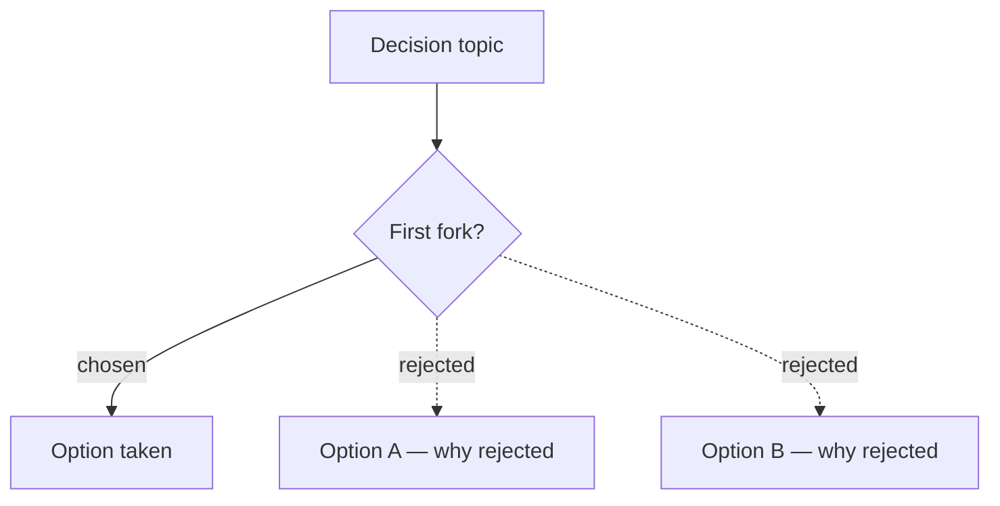

# BBQ Report Reference

The report format + the fork-diagram convention. Loaded on demand from `SKILL.md`.

## Report file

- **Location:** `docs/session/` — create it if missing (`mkdir -p docs/session`). One file per run, committed alongside the work it describes.
- **Name:** `YYYY-MM-DD-bbq-<slug>.md` — date first so same-day runs sort, `<slug>` a short kebab of the session topic.
- **Format:** plain GitHub-flavored Markdown. **No special viewer or CLI is required** — it's a normal `.md`; open it in whatever editor or previewer you use. (If you happen to have a Markdown desktop viewer, point it at `docs/session/` — but never make the skill depend on one.)

## Frontmatter contract

Five base keys are always present; the count keys make the report greppable:

```yaml
---
date: YYYY-MM-DD     # `date +%Y-%m-%d`
time: "HH:MM"        # `date +%H:%M` — real clock time, never estimated (orders same-day runs)
skill: bbq
context: <slug>      # matches the filename slug
decisions: N
recorded: N
unrecorded: N
open_threads: N
---
```

## Fork-diagram convention

When the session resolved a non-trivial decision tree, render it as a Mermaid `flowchart` so the closed branches are visible at a glance. **Chosen** path = solid arrow with a `|chosen|` label; **rejected** branches = dotted arrows (`-.rejected.->`). This makes "why didn't we do X" answerable from the diagram alone.

````markdown

````

## Recorded vs unrecorded

- **Recorded** — a file change in the diff captures the decision (a glossary term, a decision record, an updated rule/spec). Cite the file.
- **Unrecorded** (`⚠`) — the decision lives only in the conversation. These are the risk: list them at the end and recommend formalising before the session is forgotten.
